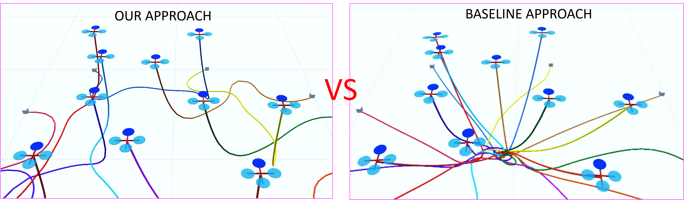

# Path Planning for Multiple Tethered Robots Using Topological Braids #
### **Accepted for publication in Robotics: Science and Systems (RSS) 2023**

This repository contains the supplementary document and the source code for the work.
### 
[](https://youtu.be/igP7eaOyZuc)

## Citation

If you find this work useful, please cite [Path Planning for Multiple Tethered Robots Using Topological Braids](https://arxiv.org/abs/2305.00271) ([pdf](https://arxiv.org/abs/2305.00271), [video](https://youtu.be/igP7eaOyZuc)):

```bibtex
@INPROCEEDINGS{Cao-RSS-23, 
    AUTHOR    = {Muqing Cao AND Kun Cao AND Shenghai Yuan AND Kangcheng Liu AND Yan Loi Wong AND Lihua Xie}, 
    TITLE     = {{Path Planning for Multiple Tethered Robots Using Topological Braids}}, 
    BOOKTITLE = {Proceedings of Robotics: Science and Systems}, 
    YEAR      = {2023}, 
    ADDRESS   = {Daegu, Republic of Korea}, 
    MONTH     = {July}, 
    DOI       = {10.15607/RSS.2023.XIX.106} 
} 
```
